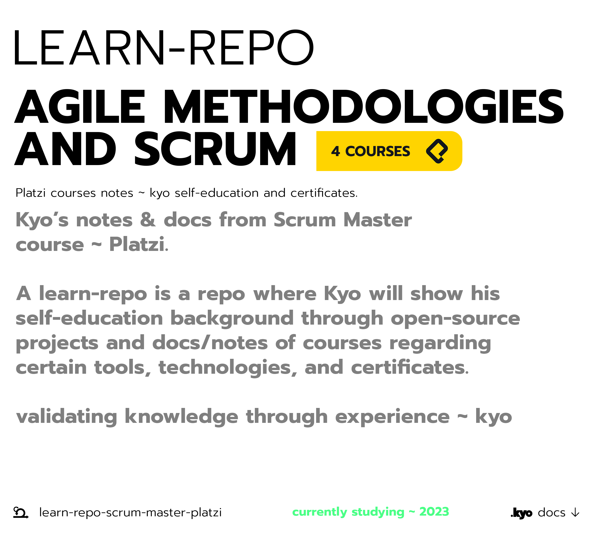

 
<a href="https://www.reddit.com/user/kyonax_on"><a/>
<a href="https://twitter.com/kyonax_on_tech" target="_blank"><a/>
<a href="https://www.instagram.com/is.kyonax/" target="_blank"><a/>
<a href="https://www.linkedin.com/in/kyonax/" target="_blank"><a/>  

  <a id="cover" href="#cover">
    <picture>
      <source media="(prefers-color-scheme: dark)" srcset="github/dark.png">
      
    </picture>
  </a>

# Table of Contents
- [Summary](#summary)
- [Curriculum](#curriculum)

# Summary
This `learn-repo` is a **documentation about the self-education course in agile methodologies and scrum** taken in the **Platzi's Scrum Master Course** complementing it with open source projects using the technologies learned, with the mission to create an educational background to support or validate the knowledge and experience with the technologies and tools dedicated to **Scrum.**

This repo is NOT replacing or transcribing any information that you can find in the actual course [Platzi Scrum Master](https://platzi.com/ruta/rol-de-scrum-master/), the repo is just a curriculum to show what I learned in the Platzi course, and to show what I can build with the technologies learned in it.

**Organization**. Course education structure:
- *Scrum Professional Course*
- *User Stories Course in Scrum*
- *Scrum Master Course*
- *Agile Team Management Course*

# Curriculum
**Curriculum version**: `0.1.0`
- [Scrum Professional Course](#scrum-professional-course)
  - [The Scrum Team and its roles](#the-scrum-ream-and-its-roles)

## Scrum Professional Course
Be successful in your projects by applying the most successful agile framework. Master the Scrum methodology and use it to deliver value to your customers through iterative deliveries that allow you to make improvements on the fly and learn in the process.

### Introduction to Agile Methodologies and Scrum
Agile and Scrum theory and basics, start with the beginning:

- Scrum Professional Course
    - [Introduction to Agile Methodologies and Scrum](Notes/ScrumProfessionalCourse/introduction.org)

### The Scrum Team and its Roles
Scrum Roles:

- Scrum Professional Course
    - [The Scrum Team and its Roles](Notes/ScrumProfessionalCourse/the-scrum-team-and-its-roles.org)